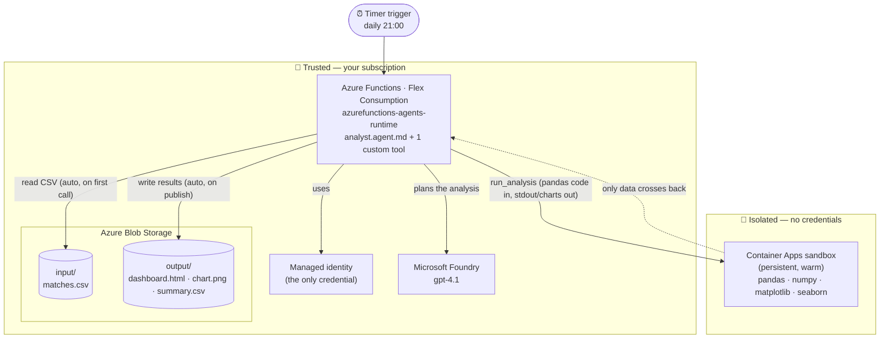
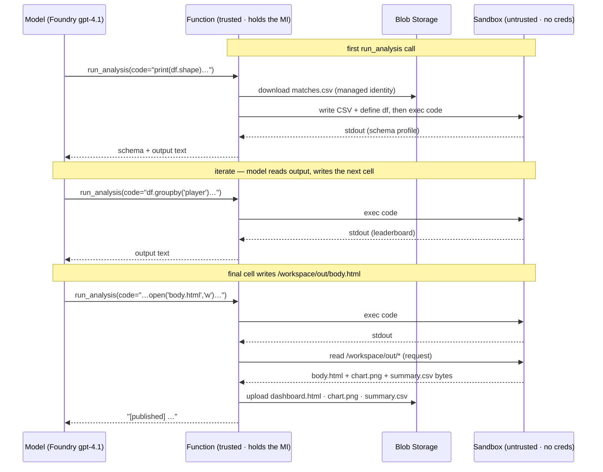

# Sports Analytics Agent — headless, serverless, sandboxed

A timer-triggered [Azure Functions](https://learn.microsoft.com/azure/azure-functions/) agent that turns a raw match-statistics **CSV in Blob Storage** into a polished **HTML insights dashboard** — with a rendered chart — written back to Blob Storage. No chat, no UI, no one watching: it runs on a schedule, analyses the data with `pandas`/`matplotlib`/`seaborn` inside an isolated **Azure Container Apps sandbox**, and publishes the result.

The sample dataset is synthetic player-innings statistics from a women's cricket world cup, but nothing is cricket-specific: drop in any tabular CSV and the agent profiles its schema, computes insights, and builds a dashboard.

It runs **enterprise and headless**: instead of a human typing questions, a **timer** fires, the agent reads a file, reasons about it, writes and runs its own analysis code (self-correcting from errors), and ships a report — entirely unattended.

## Architecture



### The pieces

| Piece | Role |
| --- | --- |
| **Timer trigger** | Fires on a schedule (`0 0 21 * * *` — daily at 21:00). Nobody invokes it; it just runs. |
| **Azure Functions (Flex Consumption)** | Hosts the `azurefunctions-agents-runtime`. The agent, its instructions, and the custom tool live here. Holds the **managed identity** — the trust anchor. |
| **Serverless agent (`analyst.agent.md`)** | A Markdown file: front-matter wires the timer trigger; the body is the system prompt telling the agent how to analyse the data and publish the dashboard. |
| **Microsoft Foundry (gpt-4.1)** | The model the agent reasons with — it decides what pandas to write and how to narrate the findings. |
| **Azure Blob Storage** | The data plane. An `input` container holds the CSV to analyse; an `output` container receives the dashboard, chart, and summary CSV. No data flows through chat. |
| **Azure Container Apps sandbox** | A **persistent, warm** Linux sandbox where the agent's analysis code actually runs. It holds **no credentials** — only the CSV goes in and only results come out. |

### One custom tool wraps the ACA Sandbox SDK + Blob SDK

The agent has a **single** custom Python tool, `run_analysis` (in [src/tools/](src/tools/)). It is a thin `@tool` wrapper; the real work is in [_analyst_common.py](src/tools/_analyst_common.py), which drives the [Azure Container Apps Sandbox SDK](https://pypi.org/project/azure-containerapps-sandbox/) and the Blob SDK. Getting the CSV **in** and the dashboard **out** is handled deterministically in that backend (where the managed identity lives), so the agent never needs a separate load or publish tool — it just writes pandas code:

```python
from azure.containerapps.sandbox import SandboxGroupClient, endpoint_for_region
from azure.storage.blob import BlobServiceClient

# One warm, persistent sandbox is reused across runs (data stack installed once).
client = group.begin_create_sandbox(
    disk="ubuntu", cpu="1000m", memory="2048Mi",
    auto_suspend_seconds=600, auto_suspend_mode="Memory",
    labels={"app": "sports-analytics", "dataset": "cricket"},
).result()
client.ensure_running(timeout=300)
client.write_file("/workspace/data/matches.csv", csv_bytes)  # data in  (auto, first call)
result = client.exec("python3 /workspace/_runner.py")          # agent's code runs
png = client.read_file("/workspace/out/chart.png")             # results out (auto, on publish)
```

| Step (all via `run_analysis`) | What the backend does |
| --- | --- |
| **Load** (automatic, first call) | Downloads the input CSV from Blob Storage, writes it into the warm sandbox, loads it as a `pandas` DataFrame `df`, and prepends the schema (columns, dtypes, sample rows, numeric summary) to the call's output. Reloads only when the input blob changes. |
| **Analyse** (every call) | Runs the agent's Python in the **stateful** sandbox. `df`, variables, and imports persist across calls, so the agent iterates: run code → read stdout/stderr → fix → repeat. |
| **Publish** (automatic, when ready) | As soon as the agent writes `/workspace/out/body.html` (its narrative, with a `{{CHART}}` token), the backend embeds the saved `chart.png` into a styled, self-contained HTML dashboard and uploads `dashboard.html`, `chart.png`, and `summary.csv` to the output container. |

Because the sandbox is kept **warm across runs**, the `pip install` of the data stack happens once; later runs start fast and (via `dill` session persistence) can even reuse in-memory state between analysis steps within a run.

### How a run works

1. **Timer fires.** The runtime starts the agent with the instructions in `analyst.agent.md`.
2. **Load (automatic).** The agent's first `run_analysis` call triggers the backend to pull `matches.csv` from the `input` container into the sandbox; the call returns the dataset schema as `df`.
3. **Analyse.** The agent writes `pandas` code and runs it with further `run_analysis` calls — computing leaderboards (top run-scorers, wicket-takers, strike rates, economy, team records), reading any tracebacks, and correcting itself.
4. **Visualise.** It renders a chart with `matplotlib`/`seaborn` and saves it (plus a summary CSV) inside the sandbox.
5. **Publish (automatic).** In a final cell the agent writes its narrative to `/workspace/out/body.html`; the backend immediately builds the HTML dashboard with the chart embedded and writes everything to the `output` container.

### Code in, text out: how the agent drives the sandbox

The agent never sends the sandbox a question in English — every `run_analysis` call carries a **string of Python code**. The model decides *what* to compute, writes the pandas to compute it, and reads back the printed output to decide the next step. Each call is a synchronous round-trip: the function hands the code to the sandbox, waits for it to finish, and returns the captured `stdout`/`stderr` to the model.



Every arrow back into **F** is the call returning: the sandbox is a synchronous step *inside* each tool call, not a place the run hands off to. The model stays in control the whole time, reading each result before writing the next cell.

### Why many small calls — and why persistence is the point

A single run makes **several** `run_analysis` calls into the **same** warm sandbox, not one big one. That's deliberate: the model behaves like an analyst in a notebook, not a script author. A run from this sample looked like:

| Call | What it does | Why it can't just be merged |
|------|--------------|------------------------------|
| 1 — **look** | `df.shape`, `dtypes`, `head`, `describe` | The model doesn't know the columns yet. It *must* see the schema before it can write any aggregation. |
| 2 — **compute** | batting & bowling leaderboards → `batting_df`, `bowling_df` | Reads call 1's output to pick the right columns. |
| 3 — **compute** | team wins/losses/runs → `tm_summary` | Builds on the live state from call 2. |
| 4 — **visualise** | `matplotlib` chart + `summary.csv` | **Reuses** `batting_df` from call 2 — never recomputes it. |
| 5 — **publish** | writes `body.html` tables | **Reuses** `batting_df`, `bowling_df`, `tm_summary` from earlier calls. |

**Could the model have done it in one giant cell?** Calls 2–4 have no hard ordering between them, so in principle it could collapse them — but call 1 *must* come first and return, because you can't write `groupby('runs_scored')` until you've seen that the column exists. At minimum it's **look → act**. In practice the model splits further, and that incremental style is exactly what makes a **stateful** sandbox valuable:

- **See before you write.** Each call's `stdout` returns to the model, so it grounds the next cell on real output (actual column names, actual leaderboard) instead of guessing.
- **Self-correction.** If a cell throws, the traceback comes back as text and the model fixes just that cell — the variables built by earlier calls are still alive.
- **Error isolation.** A failure in call 3 doesn't destroy `batting_df` from call 2. One mega-cell would lose everything on a single traceback and have to restart from scratch.
- **Reuse, not recompute.** `batting_df` is computed once (call 2) and reused in calls 4 and 5. Persistence — a `dill`-backed kernel that survives across `exec` calls — is what makes that free.

> The takeaway for this scenario: if the goal were one batch script, you wouldn't need a persistent sandbox at all. Persistence pays off *precisely because* the LLM works incrementally — exploring data it has never seen, reading each result, and self-correcting — which is the behaviour you want from an autonomous analyst.

## Project layout

```
sports-analytics-agent/
├── azure.yaml                     # azd service definition
├── sample-data/
│   └── matches.csv                # synthetic women's cricket world cup stats (seed the input container)
├── sample-output/                 # example artifacts from a live run (dashboard.html, chart.png, summary.csv)
├── infra/                         # Bicep: Functions, Foundry, sandbox group, Blob, RBAC
│   ├── main.bicep
│   ├── main.parameters.json
│   └── app/
│       ├── api.bicep              # Function App (Flex Consumption)
│       ├── foundry.bicep          # Microsoft Foundry account + gpt-4.1 + role assignments
│       ├── rbac.bicep             # Storage + App Insights role assignments
│       ├── sandbox-group.bicep    # Container Apps sandbox group (preview)
│       └── sandbox-group-rbac.bicep
└── src/
    ├── analyst.agent.md           # the timer-triggered agent (instructions + trigger)
    ├── agents.config.yaml         # model + timeout
    ├── function_app.py            # create_function_app()
    ├── host.json
    ├── requirements.txt
    ├── pyproject.toml
    ├── local.settings.json.sample
    └── tools/
        ├── _analyst_common.py     # sandbox + blob backend (not a tool)
        └── run_analysis.py        # @tool run_analysis (the agent's only tool)
```

## Deploy it

Prerequisites: [Azure Developer CLI (`azd`)](https://learn.microsoft.com/azure/developer/azure-developer-cli/install-azd), an Azure subscription, and access to the Container Apps **sandboxGroups** preview and Microsoft Foundry.

```bash
cd sports-analytics-agent
azd up
```

Pick a region that supports all three of Flex Consumption, `Microsoft.App/sandboxGroups`, and the Foundry gpt-4.1 deployment — e.g. **eastus2** (note: `eastus` does **not** support sandbox groups). `azd up` provisions everything and deploys the function app.

### Seed the input data

Upload the sample CSV to the `input` container (the deploying user is granted Storage Blob Data Contributor):

```bash
az storage blob upload \
  --account-name <storageAccount> \
  --container-name input \
  --name matches.csv \
  --file sample-data/matches.csv \
  --auth-mode login --overwrite
```

Swap in your own CSV any time — keep the blob name `matches.csv` (or change `INPUT_BLOB_NAME`).

### Trigger on demand (for demos)

The schedule is daily at 21:00, but you can fire it immediately by calling the timer function's admin endpoint:

```bash
# get the function key, then POST to the admin endpoint
curl -X POST "https://<functionApp>.azurewebsites.net/admin/functions/<timer-function-name>" \
  -H "x-functions-key: <masterKey>" -H "Content-Type: application/json" -d '{}'
```

### View the dashboard

Open `output/dashboard.html` from the `output` container (download it from the portal, or generate a short-lived SAS link). It's a single self-contained file with the chart embedded — no hosting required. `chart.png` and `summary.csv` are written alongside it.

## Security & isolation

- **The sandbox holds no credentials.** Only the CSV goes in and only results (text, a PNG, a summary CSV) come out. There is no managed identity inside the sandbox.
- **The function app's managed identity** is the only trust anchor. It reads/writes blobs (Storage Blob Data Owner) and drives the sandbox data plane (SandboxGroup Data Owner). No keys or connection strings are stored.
- **No secrets in the repo.** `local.settings.json` is git-ignored; the sample only ships a `.sample` with empty placeholders. All wiring is injected as app settings by Bicep at deploy time.
- **The sample data is synthetic.** Player and team names in `sample-data/matches.csv` are fictional and for demonstration only.

## Notes

- The sandbox **auto-suspends** when idle (state preserved on disk) and resumes on the next run, so you only pay for active compute while keeping the warm-start benefit.
- This app uses a **custom** sandbox tool, not the `dynamic_sessions_code_interpreter` system tool, because it needs to move a file (the CSV) in and pull artifacts (the chart) out, and to keep one sandbox warm across scheduled runs.
- Sandbox lifecycle (`SANDBOX CREATED`, `DATASET LOADED`, `DASHBOARD PUBLISHED`) is logged to Application Insights `traces` for live visibility during a demo.
